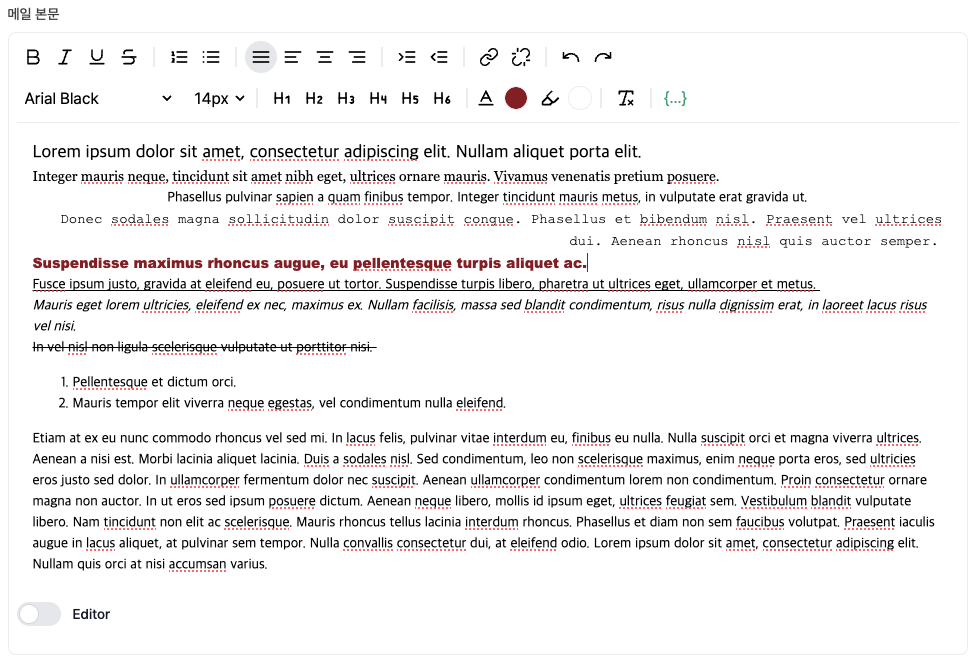
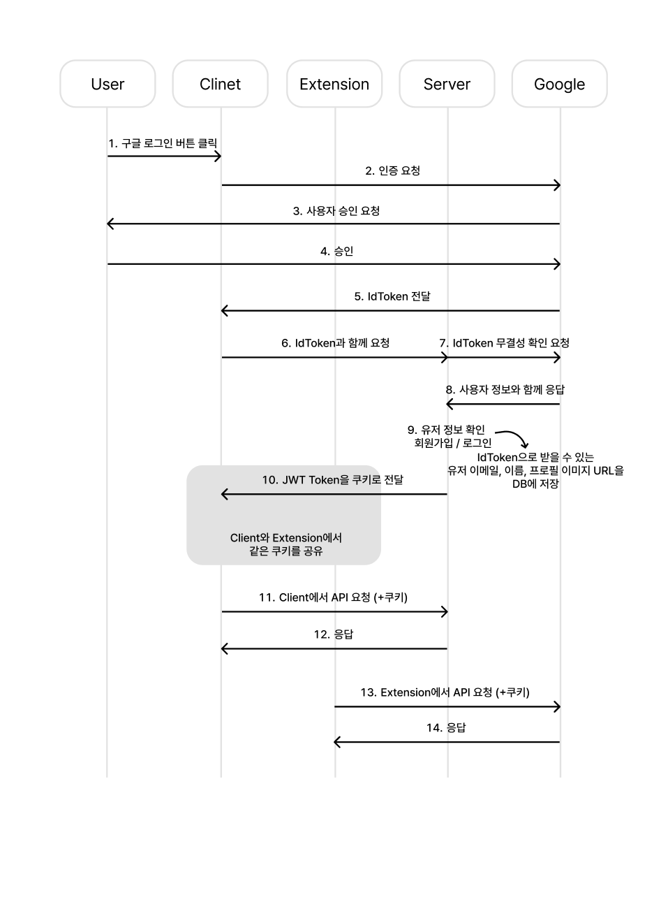
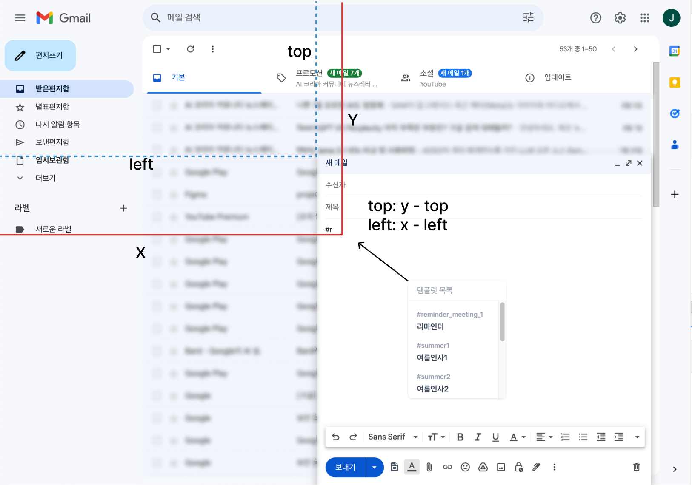

# 🌱 Glerk

<div align="center">
  <h3>Glerk: Gmail Template Chrome Extension</h3>
  <p>Glerk은 지메일 사용자들이 편리하고 효율적으로 이메일 템플릿을 사용할 수 있게 도와주는 크롬 익스텐션입니다.</p>
  <p>이메일 템플릿 중 반복적으로 수정하는 부분을 변수로 관리해 적은 노력으로 빠르게 템플릿을 적용할 수 있습니다.</p>
</div>

<br />

## 1년간 직장인의 평균 이메일 업무 시간 약 458시간

이메일은 현대 비즈니스와 일상에서 중요한 소통 수단으로 자리잡았습니다.  
많은 사람들이 매일 수십 개의 이메일을 주고받으며, 종종 비슷한 내용의 메일을 반복해서 작성하곤 합니다.

이러한 반복적인 이메일 작성 업무는 시간과 노력을 많이 요구하며, 때로는 실수나 일관성 없는 내용으로 인해 전문성을 해칠 수 있습니다.

<b>"자주 그리고 반복적으로 보내는 이메일을 더 빠르고 정확하게 작성할 수는 없을까요?"</b>  
<b>"이메일 템플릿을 쉽게 관리하고, 필요할 때 바로 적용할 수 있다면 어떨까요?"</b>

이러한 고민에서 출발하여, 저는 지메일 사용자들의 이메일 작성 경험을 개선하고자 지메일 템플릿 크롬 익스텐션 프로젝트를 시작하게 되었습니다.

사용자별로 커스터마이즈된 템플릿을 쉽게 관리하고, 변수 기능을 통해 유연하게 내용을 수정할 수 있으며, 수신자 정보까지 미리 설정할 수 있는 기능을 통해 이메일 작성의 효율성과 일관성을 높이고자 했습니다.

이 프로젝트를 통해 사용자들이 더 빠르고 정확하게 이메일을 작성하여 업무 효율성을 높이고 반복적인 작업에서 오는 피로를 줄이며 궁극적으로는 더 나은 커뮤니케이션을 할 수 있기를 희망합니다.

<br />

## 1. 목차

- [1. 목차](#1목차)
- [2. 둘러보기](#2-둘러보기)
  - [2-1. 시연 영상](#2-1-시연-영상)
  - [2-2. 링크](#2-2-링크)
  - [2-3. Github](#2-3-github)
- [3. 프로젝트 기술 스택](#3-프로젝트-기술-스택)
- [4. 실수를 예측하는 이메일 자동완성 알고리즘 구현](#4-실수를-예측하는-이메일-자동완성-알고리즘-구현)
- [5. 이메일 본문 텍스트 에디터 구현하기](#5-이메일-본문-텍스트-에디터-구현하기)
- [6. 크롬 익스텐션과 웹 사이트의 로그인 상태 동기화 하기](#6-크롬-익스텐션과-웹-사이트의-로그인-상태-동기화-하기)
- [7. 지메일 에디터에서 리액트 인터랙티브 컴포넌트 자유자재로 적용하기](#7-지메일-에디터에서-리액트-인터랙티브-컴포넌트-자유자재로-적용하기)
  - [7-1. 지메일 에디터와 별개의 리액트 컴포넌트](#7-1-지메일-에디터와-별개의-리액트-컴포넌트)
  - [7-2. 지메일 에디터의 텍스트 커서 위치에 커스텀 템플릿 넣기](#7-2-지메일-에디터의-텍스트-커서캐럿-위치에-커스텀-템플릿-넣기)
  - [7-3. 지메일 에디터에서 리액트 컴포넌트를 부르는 나만의 단축어 만들기](#7-3-지메일-에디터에서-리액트-컴포넌트를-부르는-나만의-단축어-만들기)
- [8. 프로젝트 회고](#8-프로젝트-회고)

<br />

## 2. 둘러보기

### 2-1. 시연 영상
[](https://www.youtube.com/watch?v=so2cE7gSRoE?t=0s)

### 2-2. 링크

🖥️ [Glerk 크롬 익스텐션 웹 스토어](https://chromewebstore.google.com/detail/glerk-gmail-template-exte/bljmmndpjhodogkfenjjlnbfhnonjlhn?hl=ko)  
🖥️ [Glerk 웹 사이트](https://app.glerk.site)  

### 2-3. Github
🔗 [Extension Repository](https://github.com/glerk-gmail-template-extension/glerk-chrome-extension)  
🔗 [Frontend Repository](https://github.com/glerk-gmail-template-extension/glerk-client)  
🔗 [Backend Repository](https://github.com/glerk-gmail-template-extension/glerk-server)  

<br />

## 3. 프로젝트 기술 스택

### Chrome Extension

   

### Client

     

### Server

        

<br />

## 4. 실수를 예측하는 이메일 자동완성 알고리즘 구현
Glerk 사이트의 이메일 입력 기능을 개선하기 위해 이메일 자동완성 알고리즘을 구현했습니다.

이 알고리즘을 개발하게 된 주요 이유는 다음과 같습니다.

1. 사용자 편의성: 정확한 이메일 주소를 기억하지 못하더라도 추천 이메일을 통해 입력 가능
2. 오류 감소: 잘못된 이메일 주소 입력으로 인한 문제 최소화
3. 효율성 증대: 이메일 입력 시간을 단축하여 전반적인 사용자 경험 개선

<br/>

초기에는 트라이(Trie) 자료구조를 활용한 단순한 접두사 매칭 방식을 사용했습니다. 

> 트라이(Trie)는 문자열 검색에 특화된 트리 형태의 자료구조입니다.  
> 각 노드가 문자(character)를 나타내며, 루트에서 특정 노드까지의 경로가 하나의 문자열을 표현합니다.  
> 이 구조는 특히 접두사 검색에 O(k) 시간 복잡도(k는 검색어의 길이)로 매우 효율적입니다.
 
- "glerk"을 입력할 경우 "glerk"으로 시작하는 이메일 추천  

하지만 이 방식은 사용자가 이메일 주소의 중간이나 끝 부분을 입력할 경우 적절한 결과를 제공하지 못하는 한계가 있었습니다.  
또한, 사용자의 오타나 실수에 대응하지 못해 유연성이 부족한 문제도 있었습니다.
- "erk"를 입력한 경우, "glerk"은 자동완성 이메일 리스트에 포함되지 않음
- "glrek"으로 잘못 입력한 경우, "glerk"은 자동완성 이메일 리스트에 포함되지 않음

<br />

이러한 문제를 해결하기 위해 다음과 같은 목표를 설정했습니다.

1. 다양한 입력 패턴에 대응 가능한 검색 알고리즘 구현
2. 사용자의 오타나 실수를 고려한 유사 이메일 추천 기능 추가
3. 빠른 검색 속도 유지

<br />

다양한 입력 패턴에 대응 가능한 검색 알고리즘의 단계는 다음과 같습니다.

| 1 단계: 접두사 매칭 (getPrefixMatches) | ➔ | 2 단계: 부분 문자열 매칭 (getSubstringMatches) | ➔ | 3 단계: 유사 문자열 매칭 (getSimilarMatches) |
|:---:|:---:|:---:|:---:|:---:|

<br />

1 단계) 접두사 매칭 (getPrefixMatches):  
트라이 구조를 그대로 활용하여 입력된 문자열로 시작하는 모든 이메일을 찾습니다.  
예: "gle"입력 시, `glerk@example.com`, `glenn@test.com` 등을 찾습니다.

2 단계) 부분 문자열 매칭 (getSubstringMatches):  
트라이의 모든 노드를 순회하며 입력된 문자열을 포함하는 이메일을 찾습니다.  
예: "erk"입력 시, `glerk@example.com`, `clerk@test.com` 등을 찾습니다.

3 단계) 유사 문자열 매칭 (getSimilarMatches):  
편집 거리 알고리즘을 사용하여 입력된 문자열과 유사한 이메일을 찾습니다.  
예: "glrek"입력 시, `glerk@example.com`을 찾을 수 있습니다.

<br />

편집 거리 알고리즘은 두 문자열 간의 유사도를 측정하는 방법입니다.

알고리즘의 동작 원리는 다음과 같습니다.

1. 한 문자열을 다른 문자열로 변환하는데 필요한 최소 편집 횟수를 계산합니다.
2. 허용되는 편집 연산은 삽입, 삭제, 대체입니다.
3. 예를 들어, "glrek"과 "glerk"의 편집 거리는 1입니다. (r과 e의 위치를 바꾸는 연산 1회)

편집 거리 알고리즘을 다음과 같이 활용했습니다.

1. 입력된 문자열과 저장된 이메일 주소 중 '@'의 앞 부분을 비교합니다.
2. 편집 거리가 1 이하인 경우, 해당 이메일을 유사한 이메일로 간주하여 추천 목록에 포함시킵니다.
3. 이를 통해 한 글자 오타나 글자 순서 바뀜과 같은 일반적인 실수에 대응할 수 있습니다.

<br />

이렇게 3단계로 나누어 검색함으로써 사용자의 다양한 입력 패턴에 대응하고, 사용자의 오타나 실수에도 유연하게 관련성 높은 이메일 주소를 추천할 수 있게 되었습니다.

<br />

## 5. 이메일 본문 텍스트 에디터 구현하기

### 5-1. 편집 과정을 바로 확인할 수 있는 WYSIWYG 인터페이스 구현
템플릿 변수 삽입 기능이나 HTML 입력 모드를 지원하기 위해 직접 WYSIWYG 텍스트 에디터를 구현해 보았습니다.

> WYSIWYG는 "What You See Is What You Get"의 줄임말로, "보는 대로 얻는다"라는 뜻입니다.  
> 이는 문서 편집 과정에서 화면에 보이는 내용이 실제 출력물과 동일하게 나타나는 방식을 말합니다.

조사를 통해, 에디터 구현에는 주로 `document.execCommand()`나 `Selection API`가 활용되는 것을 발견했습니다.

두 방식의 차이점은 다음과 같습니다.

| 특성 | execCommand | Selection API |
|------|-------------|----------------|
| 구현 난이도 | 쉬움 | 복잡함 |
| 브라우저 호환성 | 대부분의 브라우저에서 지원<br /> (단, 일부 기능은 브라우저마다 다름) | 모든 최신 브라우저에서 일관된 지원 |
| 유연성 | 제한적 | 높음 |
| 성능 | 간단한 작업에 적합 | 복잡한 조작에 더 효율적 |
| 유지보수 | Deprecated로 인해 향후 지원 중단 가능성 | 지속적인 지원과 개선 |
| 커스터마이징 | 제한적 | 높은 자유도 |
| 학습 곡선 | 상대적으로 낮음 | 상대적으로 높음 |

<br />

프로젝트의 개발 기간이 짧았기 때문에, 기본적인 텍스트 편집 기능을 쉽고 빠르게 구현할 수 있는 `document.execCommand()`를 채택했습니다.

<br />

에디터 구현에 있어 고민 중 하나는 다양한 스타일링 옵션을 제공하는 많은 버튼을 어떻게 효율적으로 관리할 것인가였습니다.

이 문제를 해결하기 위해 먼저, EDITOR_FEATURES라는 상수 배열을 정의하여 각 버튼의 속성을 객체로 관리했습니다.  
이 방식을 통해 버튼 설정을 한 곳에서 관리할 수 있게 되어 새로운 기능 추가나 수정이 용이해졌고, 코드의 가독성과 유지보수성도 향상되었습니다.  
또한, `<IconButton />`이라는 재사용할 수 있는 컴포넌트를 만들어 모든 버튼에 일관된 UI를 적용하고 코드 중복을 줄였습니다.

다음으로 버튼 렌더링에는 동적 렌더링 방식을 채택하여 EDITOR_FEATURES 배열을 map 함수로 순회하며 버튼들을 생성했습니다. 이를 통해 코드양을 줄이고 확장성을 높일 수 있었습니다.

<div align="center">
  
  <p>🔼 구현한 텍스트 에디터</p>
</div>

버튼 클릭 시의 동작은 applyCommand 함수를 통해 추상화하여 코드 중복을 줄이고 일관성을 유지했습니다.
```js
export const applyCommand = (command, value = null) => {
  document.execCommand(command, false, value);
};
```

<br />

텍스트 에디터의 기본 기능은 잘 작동했지만, 사용자가 현재 커서 위치의 텍스트에 적용된 스타일을 쉽게 파악하기 어렵다는 문제가 있었습니다.

이 문제를 해결하기 위해 다음과 같은 방법을 사용했습니다.

1. selectionchange 이벤트를 활용하여 커서 위치 변경을 감지했습니다.
2. window.getComputedStyle() 메서드로 현재 텍스트의 스타일 정보를 얻었습니다.
3. 파악한 스타일 정보를 객체로 만들어 'activeFormat' 상태로 관리했습니다.
4. 스타일 상태에 따라 해당 서식 버튼의 상태를 동적으로 변경했습니다.
    - 스타일이 적용된 경우: 버튼을 활성화 상태로 표시
    - 스타일이 적용되지 않은 경우: 버튼을 비활성화 상태로 표시

이렇게 함으로써 사용자는 현재 커서 위치의 텍스트 스타일을 직관적으로 확인할 수 있게 되었습니다.

### 5-2. 텍스트 모드와 HTML 모드 구현하기

에디터의 또 다른 중요한 특징으로는 텍스트 모드와 HTML 모드를 쉽게 전환할 수 있는 UI를 구현한 점입니다.

두 가지 모드를 제공한 이유는 다음과 같습니다.

1. 사용자 경험 개선: 일반 사용자는 시각적 편집이 편리하지만, HTML로 직접 편집하는 것을 선호하는 사용자가 있을 수 있습니다.
2. 유연성 제공: 복잡한 구조나 스타일을 적용할 때 HTML 모드가 더 효과적일 수 있습니다.

이러한 두 가지 모드를 원활하게 제공하기 위해, 텍스트와 HTML 간의 변환 알고리즘을 구현했습니다.

이 알고리즘은 사용자가 모드를 전환할 때마다 현재 내용을 적절한 형식으로 변환합니다.  
텍스트 모드에서 HTML 모드로 전환할 때는 텍스트에 적용된 스타일과 구조를 HTML 태그로 변환하고, HTML 모드에서 텍스트 모드로 전환할 때는 HTML 태그를 파싱하여 해당하는 시각적 스타일로 렌더링합니다.  
이 과정에서 데이터의 일관성을 유지하고 사용자의 편집 내용이 손실되지 않도록 주의를 기울였습니다.

<br />

하지만 이 기능을 구현하면서 HTML을 직접 입력할 경우 XSS(Cross-Site Scripting) 공격 가능성이 존재함을 발견했습니다.

> XSS는 악의적인 스크립트를 웹 페이지에 주입하여 사용자의 데이터를 탈취하거나 피해를 주는 공격 방식입니다.

이를 방지하기 위해 다음과 같은 조치를 취했습니다.

1. DOMPurify를 사용하여 사용자 입력 HTML을 안전하게 정제 후 데이터베이스에 저장
2. 서버 측에서 HttpOnly와 Secure 쿠키 설정으로 클라이언트 측 스크립트의 쿠키 접근 제한

### 5-3. 개선 방향

짧은 시간 내에 에디터를 구현할 수 있었지만 `document.execCommand()`는 deprecated 되었기 때문에 추후 `document.execCommand()`를 `Selection API`를 활용한 방식으로 리팩토링할 계획입니다.

`Selection API`는 `execCommand()`보다 텍스트 선택과 조작에 대해 더 세밀한 제어를 제공합니다. 이를 통해 더 복잡하고 사용자 정의된 편집 기능을 구현할 수 있습니다. `execCommand()`는 비표준이기 때문에 브라우저마다 구현이 다를 수 있어 일관되지 않은 동작을 보일 수 있는 반면, 웹 표준인 `Selection API`를 사용하면 이러한 불일치를 줄일 수 있습니다.

이러한 이유들로 `Selection API`로 전환함으로써 에디터의 안정성과 기능성을 향상시키고자 합니다.

<br />

## 6. 크롬 익스텐션과 웹 사이트의 로그인 상태 동기화 하기

Glerk 사이트의 로그인 기능을 구현하기 위해 구글 OAuth 인증을 사용했습니다.

로그인 기능을 위한 여러 방식 중 구글 OAuth 인증 방식을 선택한 이유는 다음과 같습니다.

1. 사용자 편의성: 소셜 로그인을 통해 별도의 회원가입 없이 간편하게 서비스를 이용할 수 있습니다.
2. 낮은 진입 장벽: 따로 아이디와 패스워드를 만들 필요 없이 기존 계정을 활용하므로 신규 사용자 유입이 쉽습니다.
3. 타겟 사용자: 이 프로젝트는 지메일 사용자를 위한 크롬 확장 프로그램이므로, 모든 잠재 사용자가 구글 계정을 보유하고 있을 것으로 예상했습니다.

<br/>

초기에는 구글 로그인 후 서버에서 인증을 거쳐 JWT 토큰을 응답 헤더로 전송하고, 이를 localStorage에 저장하는 방식을 사용했습니다. 하지만 웹사이트와 확장 프로그램이 같은 localStorage를 사용할 수 없고 별개의 저장공간을 가지고 있기 때문에 사용자가 두 번의 로그인 과정을 거쳐야 한다는 불편함이 있었습니다.

궁극적인 목표는 다음과 같았습니다.

1. 웹사이트 로그인 시, 크롬 확장 프로그램 자동 로그인
2. 크롬 확장 프로그램에서 로그아웃 시, 웹사이트 자동 로그아웃 (반대의 경우도 동일)

이와 같이 웹사이트와 확장 프로그램 간의 원활한 로그인 상태 동기화를 구현하고자 여러 방법을 찾아보았습니다.

<br />

> manifest.json은 크롬 확장 프로그램의 핵심 구성 파일입니다.  
> 이 파일은 JSON 형식으로 작성되며, 확장 프로그램의 기본 정보와 동작 방식을 정의합니다.  
> host_permissions 필드를 통해 확장 프로그램이 접근하거나 상호작용할 수 있는 웹사이트 또는 도메인을 지정할 수 있습니다.

host_permissions 필드에 도메인을 지정할 경우 익스텐션에서 서버 요청 시 지정한 웹사이트의 쿠키를 사용할 수 있다는 점을 발견했습니다.

이를 활용하면 확장 프로그램에는 자체 인증 흐름이 불필요함과 동시에 익스텐션과 웹사이트가 완전히 동기화될 수 있겠다 판단했고, 인증 방식을 JWT 토큰 기반에서 쿠키 기반으로 전환하기로 결정했습니다.

<br />

<details>
  <summary>로그인 프로세스 초기 설계 기록</summary>
  <div align="center">
    
    <p>🔼 Google OAuth 인증을 통한 로그인 프로세스</p>
  </div>
</details>

<br />

<div align="center">
  
  <p>🔼 Google OAuth 인증을 통한 로그인 프로세스</p>
</div>

<br />
<br />

새로운 방식의 구현 과정은 다음과 같습니다.

1. manifest.json 파일의 host_permissions에 Glerk 웹사이트 도메인을 추가했습니다.
2. 서버 측에서는 로그인 성공 시 JWT 토큰을 쿠키에 저장하도록 수정했습니다.
3. 확장 프로그램에서 API 요청 시 자동으로 쿠키가 포함되도록 설정했습니다.

쿠키 기반 인증 방식으로 전환한 뒤, 사용자는 한 번의 로그인으로 웹사이트와 익스텐션 모두에서 인증 상태를 유지할 수 있게 되었습니다.

이를 통해 다음과 같은 이점을 얻을 수 있었습니다.

1. 사용자 경험 개선: 중복 로그인 과정이 제거되어 더욱 매끄러운 사용자 경험을 제공합니다.
2. 동기화 문제 해결: 웹사이트와 확장 프로그램 간의 로그인 상태가 항상 일치하게 되었습니다.
3. 보안 강화: 쿠키의 HttpOnly 및 Secure 플래그를 활용하여 클라이언트 측 스크립트로부터 토큰을 보호할 수 있게 되었습니다.

<br />

## 7. 지메일 에디터에서 리액트 인터랙티브 컴포넌트 자유자재로 적용하기

### 7-1. 지메일 에디터와 별개의 리액트 컴포넌트

지메일 페이지 내에 새로운 기능을 추가하기 위해 초기에는 바닐라 자바스크립트로 개발을 시작했습니다.  
이 접근 방식은 간단한 DOM 조작에는 효과적이었지만, 프로젝트의 규모가 커지고 기능이 복잡해지면서 상태 관리의 복잡성이 증가하면서 리액트의 도입을 고려하게 되었습니다.  

그러나 지메일과 같은 외부 사이트의 DOM에 독립적인 리액트 컴포넌트를 렌더링하는 것이 가능할지에 대한 의문이 있었습니다.
여러 검색을 통해 그것을 가능하게 도와주는 리액트의 기능인 createPortal을 발견했습니다.

createPortal을 통해 리액트 컴포넌트를 DOM 트리의 다른 부분에 렌더링할 수 있었고, 이를 활용해 지메일의 기존 DOM 구조를 유지함과 동시에 커스텀 컴포넌트를 자연스럽게 통합할 수 있었습니다.

리액트의 도입으로 아래와 같은 이점을 얻을 수 있었습니다.

1. 컴포넌트의 모듈화와 재사용성 향상
2. 리액트의 상태 관리 및 생명주기 메서드를 활용한 효율적인 개발
3. 리액트 가상 DOM을 통한 성능 최적화
4. 기존 지메일 페이지의 구조와 기능을 해치지 않는 유연한 통합

<br />

<div align="center">
  
  <p>🔼 해시태그 키워드 입력 시 지메일 DOM에 리액트 컴포넌트가 추가되는 모습</p>
</div>

<br />

### 7-2. 지메일 에디터의 텍스트 커서(캐럿) 위치에 커스텀 템플릿 넣기

사용자 경험 향상을 위해 지메일 에디터에서 사용자가 원하는 정확한 위치에 커스텀 템플릿을 삽입하는 기능을 개발하고자 했습니다.

에디터 내 캐럿 위치를 useRef에 할당하여 이를 구현하고자 했지만 이 과정에서 예상치 못한 난관에 부딪혔습니다.

1. 템플릿 선택 과정에서의 의도치 않은 캐럿 위치 변경 문제
2. 객체 참조로 인한 커서 정보 손실 문제

캐럿의 위치는 `window.getSelection()`의 반환값인 Selection 객체의 프로퍼티와 메서드를 통해 파악할 수 있습니다.  
하지만 이 Selection 객체는 텍스트를 선택하거나 커서가 이동될 때마다 실시간으로 업데이트 되는 특징을 가지고 있습니다.

따라서 JavaScript의 객체 참조 특성상 템플릿을 선택하기 직전의 캐럿 정보를 담고 있는 Selection 객체를 useRef에 저장한다 해도 캐럿의 위치가 변경된다면 useRef에는 엉뚱한 값이 들어가게 됩니다.  
이에 따라 사용자가 에디터 내 특정 위치에 템플릿을 삽입하려고 할 때, 템플릿을 선택하는 과정에서 다른 DOM 요소를 클릭한다면 캐럿 위치가 변경되어 원하는 위치에 삽입되지 않는 문제가 발생했습니다.

이 문제를 해결하기 위해 템플릿 선택 버튼을 클릭하는 시점의 캐럿 정보를 저장할 때 다음과 같은 방식을 사용했습니다.

1. 필요한 정보만 복사: Selection 객체의 모든 정보가 아닌, 필요한 정보만을 새로운 객체에 복사하여 저장
2. Range 객체의 복제: selection.getRangeAt(0).cloneRange()를 사용하여 Range 객체의 정확한 복사본 생성
3. 메서드 바인딩: Selection 객체의 주요 메서드를 새로운 함수로 래핑하여 저장

이러한 방법을 통해 캐럿 위치 정보를 안정적으로 유지할 수 있게 되었고 그 결과 사용자가 의도한 정확한 위치에 템플릿을 반영할 수 있게 되었습니다.

<br />

<div align="center">
  
  <p>🔼 텍스트 커서(캐럿) 위치에 템플릿 넣기</p>
</div>

<br />

### 7-3. 지메일 에디터에서 리액트 컴포넌트를 부르는 나만의 단축어 만들기

사용자 경험을 위해 크롬 익스텐션으로 템플릿을 적용할 때 에디터 내 버튼뿐만 아니라 지메일 에디터에서 이메일을 작성하는 중에 '#'과 특정 키워드를 입력하면 관련 템플릿 목록이 동적으로 렌더링 되도록 기획했습니다.

초기 계획은 다음과 같았습니다.

1. 사용자가 '#'을 입력하고 단축어를 입력
2. 템플릿 목록이 현재 캐럿 위치의 오른쪽 아래에 표시

그러나 구현 과정에서 다음과 같은 문제를 마주했습니다.

<div align="center">
  
  <p>🔼 해시태그 키워드 입력 시 의도하지 않은 위치에 렌더링 되는 컴포넌트</p>
</div>

<br />

1. 템플릿 리스트 렌더링을 위해 컴포넌트에 position absolute 속성과 top, left 값을 적용
2. 캐럿 위치는 window 기준으로 얻을 수 있었지만, 실제 렌더링은 지메일 에디터 창 기준으로 이루어짐
3. 결과적으로 템플릿 목록이 의도하지 않은 위치에 표시되는 문제 발생

이를 해결하기 위해 window 창 기준의 좌표를 지메일 에디터 기준으로 변환하는 로직을 개발했습니다.

<div align="center">
  
  <p>🔼 좌표 기준을 지메일 에디터 기준으로 변환</p>
</div>

<br />

위 문제를 해결한 후, 또 다른 사용성 이슈에 직면했습니다.

캐럿이 화면의 오른쪽 하단에 위치할 때 템플릿 목록 컴포넌트가 윈도우 창의 범위를 벗어나 일부가 보이지 않는 현상이 발생했습니다.

<div align="center">
  
  <p>🔼 컴포넌트가 윈도우 창 내에 위치하지 않는 케이스</p>
</div>

이는 사용자 경험을 저해하는 문제이기 때문에 이 문제를 해결하기 위해 다음과 같이 동적으로 위치를 조정할 수 있는 로직을 개발했습니다.

1. 화면 크기와 템플릿 목록 컴포넌트의 크기를 고려
2. 캐럿 위치를 기준으로 네 가지 렌더링 위치를 순차적으로 시도
    1. 우측 하단 (기본 위치)
    2. 좌측 하단
    3. 우측 상단
    4. 좌측 상단
3. 각 위치에서 컴포넌트가 윈도우 창 내에 완전히 표시될 수 있는지 확인
4. 적절한 위치를 찾으면 해당 위치에 컴포넌트 렌더링

이러한 방식을 통해 템플릿 목록 컴포넌트가 항상 화면 내에 완전히 표시되도록 하여 사용자가 어떤 상황에서도 템플릿 목록을 쉽게 보고 선택할 수 있도록 개선했습니다.

<div align="center">
  
  <p>🔼 우측 하단의 캐럿 위치에서 해시 태그 입력 시 화면 내에 위치하는 템플릿 목록 컴포넌트</p>
</div>

<br />

## 8. 프로젝트 회고

이번 프로젝트를 마무리하면서 돌이켜보니, 정말 많은 것을 배우고 경험했다는 생각이 듭니다.

이번 프로젝트를 계기로 처음으로 크롬 익스텐션을 개발해 봤는데 저에게 새로운 경험이었습니다. 처음에는 낯설고 어려웠지만 하나씩 해결해 나가면서 새로운 기술을 습득하면서 만들어 나가는 즐거움을 느꼈습니다.  
또한 이런 경험을 통해 앞으로 또 다른 새로운 도전 과제가 주어져도 잘 해낼 수 있을 거란 자신감이 생겼습니다.

무엇보다 사용자 경험을 최우선으로 고려하면서 개발을 진행했던 것이 가장 큰 수확이었습니다. 사용자의 입장에서 생각하고 사용자 경험을 위해 고민하는 과정에서 기술적 챌린지에 부딪혔고 그로 인해 처음 보는 개념들도 많았지만 그 과정에서 크게 성장할 수 있었습니다.

2주라는 시간 내에 익스텐션뿐만 아니라 프론트엔드와 백엔드까지 모두 개발하느라 일정 내에 모든 걸 완성할 수 있을지 걱정도 많이 했습니다. 하지만 결국 완성했을 때 성취감은 앞으로 개발자로서 일을 할 때 "할 수 있다"는 원동력이 되지 않을까 생각합니다.  
물론 아직 개선의 여지가 많이 있습니다. 앞으로 리팩토링을 통해 코드의 질을 높이고 사용자 경험을 더욱 개선해 나갈 계획입니다.

개인적으로 아쉬웠던 점은 팀 프로젝트와는 달리 모든 것을 혼자 해야 했기 때문에 시간 관리나 계획 수립에 어려움을 겪었던 점입니다. 특히 여러 가지 일을 동시에 진행하면서 우선순위를 정하는 게 쉽지 않았습니다.  
하지만 이런 경험 덕분에 프로젝트 관리 능력이 한층 성장했다고 느낍니다. 앞으로 또 다른 프로젝트를 진행하게 된다면, 이번 경험을 토대로 더 체계적으로 계획을 세우고 효율적으로 진행할 수 있을 것 같습니다.

이번 프로젝트를 통해 기술적인 면에서의 성장뿐만 아니라, 프로젝트 관리, 시간 관리 같은 소프트 스킬도 함께 향상될 수 있었습니다. 아직 부족한 점이 많지만, 이번 경험을 바탕으로 꾸준히 성장해 나가고 싶습니다.
